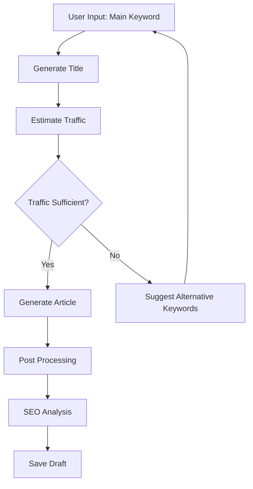
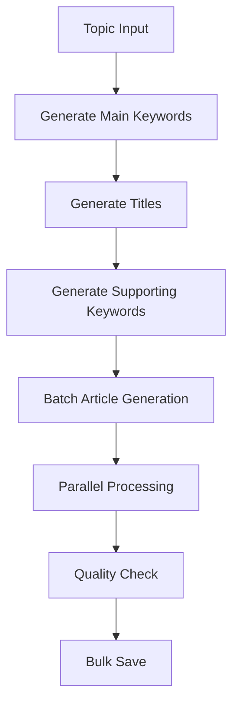
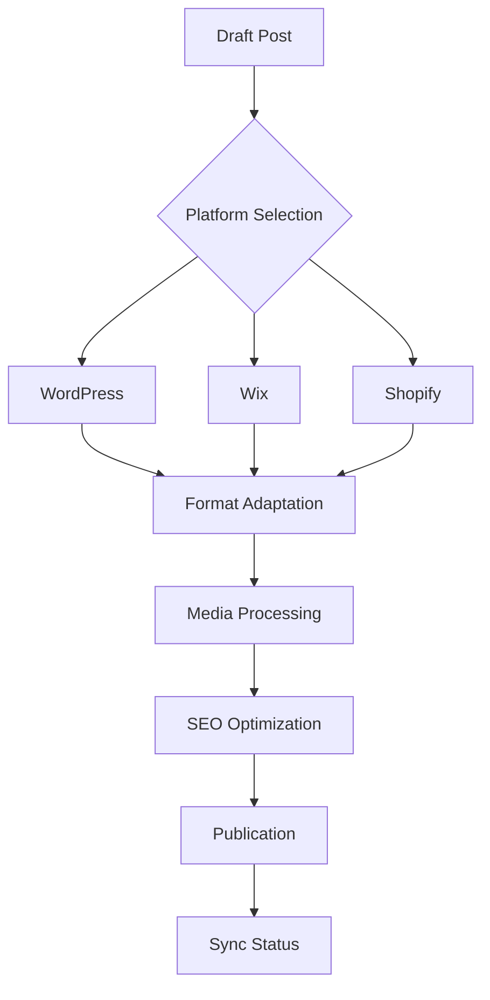

# Blog System Implementation

## Core Components

### 1. Data Models

#### BlogPost Model
```typescript
interface IBlogPost {
    userId: ObjectId;
    batchId?: ObjectId;
    mainKeyword: string[];
    title: string;
    keywords: string[];
    estimatedMonthlyTraffic: number;
    content: string;
    status: POST_STATUS;
    generationType: GENERATION_TYPE;
    seoScore: number;
    metadata: IPostMetadata;
    seoAnalysis: ISEOAnalysis;
    settings: IBlogPostSettings;    // See blog-settings.md
    mediaSettings: IMediaSettings;  // See blog-settings.md
    structure: IStructureSettings;  // See blog-settings.md
    performance: IPerformanceMetrics;
    platformPublications: IPlatformPublication[];
    createdAt: Date;
    updatedAt: Date;
}
```

#### Supporting Interfaces
```typescript
interface IPostMetadata {
    wordCount: number;
    characterCount: number;
    mainKeyword: string;
    AIPrompt: string;
    metaTitle: string;
    metaDescription: string;
    readingTime: number;
    targetAudience?: string;
    contentPurpose?: string;
}

interface ISEOAnalysis {
    mainKeywordDensity: number;
    contentLength: number;
    readabilityScore: number;
    keywordPositions: IKeywordPosition[];
    semanticRelevance?: number;
    competitionScore?: number;
}

interface IKeywordPosition {
    type: 'h1' | 'h2' | 'h3' | 'h4' | 'h5' | 'h6' | 'content' | 'meta';
    position: number;          // Character position in the content
    context: string;          // Surrounding text for context
    lineNumber: number;       // Line number in the content
    density?: number;         // Local keyword density in this section
    importance: number;       // SEO importance score (0-1)
}

interface IPlatformPublication {
    platform: SYSTEM_PLATFORM;
    status: PUBLISH_STATUS;
    publishedSiteId: number;
    publishedUrl?: string;
    publishedAt?: Date;
    error?: string;
    analytics?: {
        views: number;
        engagement: number;
        conversions: number;
    };
}

interface ITrafficEstimate {
    monthlyVolume: number;
    competition: number;
    difficulty: number;
    cpc: number;
    trend: number[];
}

interface IPostHistory {
    version: number;
    timestamp: Date;
    changes: {
        field: string;
        oldValue: any;
        newValue: any;
    }[];
    userId: ObjectId;
}
```

### 2. Service Layer

#### Single Post Service
```typescript
class SinglePostService {
    generateTitle(keyword: string): Promise<string>;
    estimateTraffic(keyword: string): Promise<ITrafficEstimate>;
    generateArticle(settings: IBlogPostSettings): Promise<string>;
}
```

#### Bulk Post Service
```typescript
class BulkPostService {
    generateMainKeywords(topic: string): Promise<string[]>;
    generateBulkTitles(keywords: string[]): Promise<string[]>;
    generateBulkKeywords(titles: string[]): Promise<string[][]>;
    generateBatch(settings: IBulkGenerationSettings): Promise<string[]>;
}
```

#### CRUD Service
```typescript
/**
 * Service responsible for blog post CRUD operations and history tracking
 */
class BlogCRUDService {
    /**
     * Retrieves blog posts based on filter criteria
     * @param filter - Filter criteria for posts
     * @returns Promise resolving to array of blog posts
     */
    getPosts(filter: IPostFilter): Promise<IBlogPost[]>;

    /**
     * Retrieves a single blog post by ID
     * @param id - Blog post ID
     * @returns Promise resolving to blog post
     */
    getPost(id: string): Promise<IBlogPost>;

    /**
     * Updates a blog post with partial data
     * @param id - Blog post ID
     * @param data - Partial blog post data to update
     * @returns Promise resolving to updated blog post
     */
    updatePost(id: string, data: Partial<IBlogPost>): Promise<IBlogPost>;

    /**
     * Updates a specific section of a blog post
     * @param id - Blog post ID
     * @param section - Section identifier
     * @param content - New content for the section
     * @returns Promise resolving to updated blog post
     */
    updateSection(id: string, section: string, content: string): Promise<IBlogPost>;

    /**
     * Deletes a blog post
     * @param id - Blog post ID
     */
    deletePost(id: string): Promise<void>;

    /**
     * Retrieves version history for a blog post
     * @param id - Blog post ID
     * @returns Promise resolving to array of history entries
     */
    getHistory(id: string): Promise<IPostHistory[]>;
}

interface IPostFilter {
    userId?: ObjectId;
    status?: POST_STATUS;
    platform?: SYSTEM_PLATFORM;
    dateRange?: {
        start: Date;
        end: Date;
    };
    keywords?: string[];
    searchText?: string;
    limit?: number;
    offset?: number;
    sort?: {
        field: keyof IBlogPost;
        order: 'asc' | 'desc';
    };
}

### 3. API Endpoints

#### Content Generation
```typescript
POST /api/blog/generate-title         // Generate blog title
POST /api/blog/keyword-traffic        // Get keyword traffic
POST /api/blog/generate-single        // Generate article
POST /api/blog/generate-main-keywords // Generate keywords
POST /api/blog/generate-bulk-titles   // Generate titles
POST /api/blog/generate-bulk-keywords // Generate keywords
POST /api/blog/bulk-generate          // Batch generation
```

#### Content Management
```typescript
GET    /api/blog                     // List posts
GET    /api/blog/single              // Get post
PATCH  /api/blog/update              // Update post
PATCH  /api/blog/update-section      // Update section
DELETE /api/blog/delete              // Delete post
GET    /api/blog/history             // Get history
```

## Business Logic

### 1. Content Processing
```typescript
class ContentProcessor {
    processMarkdown(content: string): string;
    detectStructure(content: string): IStructureAnalysis;
    analyzeSEO(content: string, keyword: string): ISEOAnalysis;
    calculateMetadata(content: string): IPostMetadata;
}
```

### 2. Publishing Workflow
```typescript
enum POST_STATUS {
    DRAFT = 'draft',
    READY = 'ready',
    PUBLISHED = 'published',
    ARCHIVED = 'archived',
    NONE = 'none'
}

enum PUBLISH_STATUS {
    PENDING = 'pending',
    PUBLISHED = 'published',
    FAILED = 'failed'
}
```

### 3. Platform Integration
```typescript
enum SYSTEM_PLATFORM {
    WORDPRESS = 'wordpress',
    WIX = 'wix',
    SHOPIFY = 'shopify',
    NONE = 'none'
}

interface IPlatformService {
    publish(post: IBlogPost): Promise<IPlatformPublication>;
    update(post: IBlogPost): Promise<IPlatformPublication>;
    delete(post: IBlogPost): Promise<void>;
    sync(post: IBlogPost): Promise<void>;
}
```

## Security & Performance

### 1. Rate Limiting
```typescript
const rateLimits = {
    'generate-single': { points: 5, duration: 3600 },
    'generate-bulk': { points: 2, duration: 3600 },
    'update': { points: 20, duration: 3600 }
};
```

### 2. Validation
```typescript
interface IValidationRules {
    title: { min: 10, max: 100 },
    content: { min: 500, max: 10000 },
    keywords: { min: 1, max: 10 },
    sections: { min: 3, max: 20 }
}
```

### 3. Performance Metrics
```typescript
interface IPerformanceMetrics {
    views: number;
    engagement: number;
    shareCount: number;
    platformMetrics: {
        [platform: string]: {
            views: number;
            likes: number;
            comments: number;
        }
    };
}
```

## Integration Requirements

### 1. Platform Integration
- WordPress REST API
- Wix Content API
- Shopify Blog API
- Custom platform adapters

### 2. AI Integration
- See `blog-settings.md` for AI configuration
- Token usage tracking
- Model-specific optimizations

### 3. Analytics Integration
- Google Analytics
- Platform-specific analytics
- Custom tracking

For detailed settings configuration, refer to `blog-settings.md`.

## Use Cases & Workflows

### 1. Content Generation Workflow

#### Single Post Generation


**Implementation Requirements:**
1. Keyword Analysis
   - Traffic estimation
   - Competition analysis
   - Trend analysis
   - Related keywords

2. Content Generation
   - Context gathering
   - Structure planning
   - Content generation
   - Post-processing

3. Quality Assurance
   - Plagiarism check
   - Fact verification
   - Style consistency
   - SEO optimization

#### Bulk Generation Process


**Implementation Considerations:**
1. Resource Management
   - Token allocation
   - Rate limiting
   - Parallel processing
   - Error recovery

2. Quality Control
   - Duplicate detection
   - Consistency check
   - Brand voice alignment
   - Cross-referencing

### 2. Publishing Workflow

#### Platform Publishing Process


**Implementation Requirements:**
1. Platform Integration
   - Authentication
   - API version handling
   - Format conversion
   - Media optimization

2. Synchronization
   - Status tracking
   - Error handling
   - Retry mechanism
   - Conflict resolution

### 3. Content Update Workflow

#### Section Update Process
```typescript
interface ISectionUpdate {
    type: 'content' | 'structure' | 'seo';
    section: string;
    content: string;
    validation: {
        minLength: number;
        maxLength: number;
        required: string[];
    };
    seoImpact: {
        keywords: boolean;
        structure: boolean;
        metrics: boolean;
    };
}
```

**Implementation Steps:**
1. Content Validation
   - Length check
   - Structure validation
   - Keyword presence
   - Format consistency

2. SEO Recalculation
   - Keyword density
   - Structure analysis
   - Score update
   - Position tracking

3. History Tracking
   - Version increment
   - Change logging
   - User attribution
   - Timestamp recording

### 4. Performance Monitoring

#### Metrics Collection
```typescript
interface IMetricsCollection {
    interval: 'realtime' | 'hourly' | 'daily';
    metrics: {
        views: number;
        engagement: {
            timeOnPage: number;
            scrollDepth: number;
            interactions: number;
        };
        seo: {
            position: number;
            clicks: number;
            impressions: number;
        };
        platform: {
            [key: string]: {
                views: number;
                engagement: number;
                revenue?: number;
            };
        };
    };
}
```

**Implementation Requirements:**
1. Data Collection
   - Real-time tracking
   - Platform integration
   - Analytics aggregation
   - Performance monitoring

2. Analysis & Reporting
   - Trend analysis
   - Performance alerts
   - Report generation
   - Optimization suggestions

## Error Handling & Recovery

### 1. Generation Errors
```typescript
interface IGenerationError {
    type: 'token_limit' | 'api_error' | 'validation_error';
    context: {
        stage: string;
        input: any;
        error: Error;
    };
    recovery: {
        strategy: 'retry' | 'fallback' | 'manual';
        attempts: number;
        backoff: number;
    };
}
```

### 2. Publishing Errors
```typescript
interface IPublishingError {
    platform: SYSTEM_PLATFORM;
    error: {
        code: string;
        message: string;
        details: any;
    };
    status: {
        canRetry: boolean;
        requiresAuth: boolean;
        isTemporary: boolean;
    };
}
```

## Integration Patterns

### 1. Platform Adapter Pattern
```typescript
interface IPlatformAdapter {
    connect(): Promise<void>;
    publish(post: IBlogPost): Promise<IPublishResult>;
    update(post: IBlogPost): Promise<IPublishResult>;
    delete(postId: string): Promise<void>;
    sync(options: ISyncOptions): Promise<void>;
}
```

### 2. Content Pipeline Pattern
```typescript
interface IContentPipeline {
    stages: {
        preparation: IStageConfig;
        generation: IStageConfig;
        processing: IStageConfig;
        validation: IStageConfig;
        publication: IStageConfig;
    };
    hooks: {
        beforeStage?: (stage: string) => Promise<void>;
        afterStage?: (stage: string) => Promise<void>;
        onError?: (error: Error) => Promise<void>;
    };
}
```

For detailed settings configuration, refer to `blog-settings.md`.

